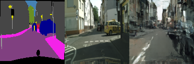
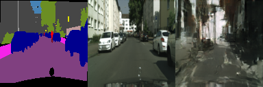
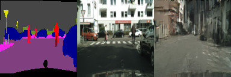
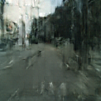
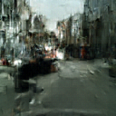
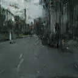
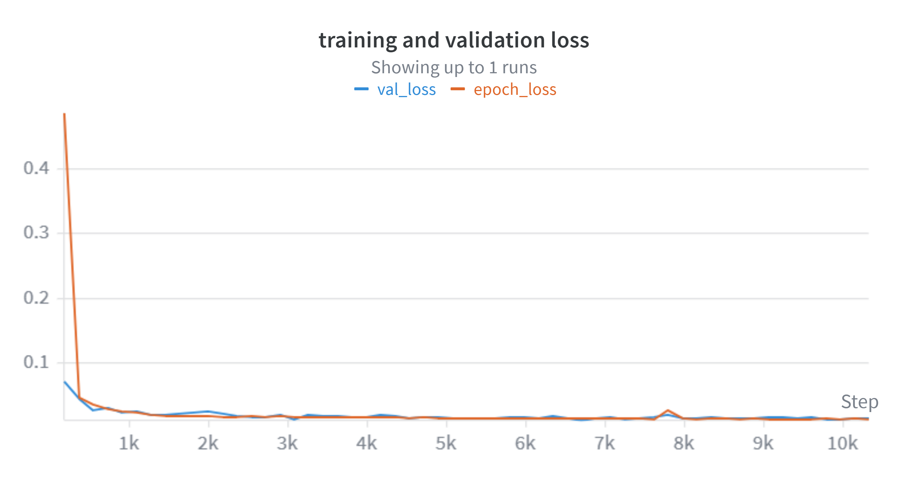

# Structured Urban Synthesis with Diffusion Transformers

## Overview

This project implements a conditional image generation pipeline for urban street scenes, trained entirely from scratch on the Cityscapes dataset. Given a semantic segmentation mask as input, the model generates a photorealistic street scene that recostructs the spatial layout defined by the mask. The core architecture is a Diffusion Transformer (DiT) trained with a standard DDPM noise schedule, extended with spatial cross-attention mask conditioning and classifier-free guidance (CFG).

---

## Files to Look At

The three files that contain the crux of the project are:

**src/models/dit.py** : full model definition. Contains TimestepEmbedder, MaskPatchEmbedder, DiTBlock with self-attention, cross-attention, and adaLN modulation, and the DiT class with the DDPM reverse process (p_sample) including CFG.

**src/train.py** : training loop. Contains the DDPM forward process, noise schedule, AdamW optimizer, linear warmup + cosine decay LR schedule, mixed precision training, early stopping, and W&B logging.

**src/inference.py** : inference script. Loads a checkpoint, runs p_sample with CFG at a specified guidance scale, and saves side-by-side mask/real/generated images.

Supporting files: 

- **src/data/dataset.py** : handles loading and augmentation.  
- **src/data/preprocess.py** : handles Cityscapes ID remapping and resizing for both gtFine and gtCoarse annotations. 
- **sweep.yaml** : defines the W&B hyperparameter search space.

---

## Installation

```bash
git clone https://github.com/kanaghasivakumar/Structured-Urban-Synthesis-with-Diffusion-Transformers 
cd Structured-Urban-Synthesis-with-Diffusion-Transformers 
pip install -r requirements.txt
```
Data needs to be downloaded from: https://www.cityscapes-dataset.com/\
It is to be placed in data folder under gtFine, gtCoarse,  and leftImg8bit subfolders respectively. This requires a registration.

Preprocess Cityscapes after downloading:
```bash
python src/data/preprocess.py --data_dir data --output_dir processed_data 
```

---

## Training
```bash
python src/train.py \
    --lr_batch 4e-4,128 \
    --patch_size 8 \
    --depth 12 \
    --num_heads 8 \
    --warmup_epochs 3 \
    --cfg_dropout 0.05 \
    --epochs 150
```

---

## Inference
```bash
python src/inference.py \
    --split val \
    --out_dir inference_out \
    --guidance_scale 3.0
```

Outputs side-by-side mask | real | generated images to inference_out/ and individual generated images to inference_out/generated/.

---

## Architecture

The model is a Diffusion Transformer trained on Cityscapes dataset images at 128×128 resolution. Images are patchified with patch size 8, producing 256 tokens per image. Each DiTBlock contains:

- Self-attention over image patch tokens
- Cross-attention where image patch tokens attend to mask patch tokens
- MLP with GELU activation
- adaLN modulation conditioned on the timestep embedding where shift, scale, and gate are applied to both attention and MLP sublayers

The mask is encoded by MaskPatchEmbedder, which one-hot encodes the 19-class segmentation mask, applies a Conv2d patch embedding, and adds learnable positional embeddings. This produces a sequence of mask patch tokens that enter every DiTBlock as cross-attention keys and values, giving the model full spatial awareness of the mask layout at every layer.

Classifier-free guidance is implemented by training with 5% mask dropout. The mask tokens are replaced with a learned null token vector. At inference, the model runs twice per timestep (conditioned and unconditioned) and the final noise estimate is:

pred_noise = unconditioned_noise + scale × (conditioned_noise − unconditioned_noise)

The noise schedule is a linear DDPM schedule with T=1000 and is trained with MSE loss.

---

## Results

### Validation Samples

\
\


### Test Samples

\
\


### Training Curves

\
You more charts at: https://wandb.ai/kanaghasivakumar-northwestern-university/structured-urban-synthesis/runs/7igu51n8?nw=nwuserkanaghasivakumar2027

### FID Score

**FID: 251.8** on the Cityscapes test set (500 images).

This is higher than ideally expected, however this project trains a DiT from scratch on 22,973 images, which is a hard problem of my own making. The generations show some spatial structure (road at bottom, sky at top, buildings in the sides) and rough color distributions that match the mask, but lack fine texture and detail.

---

## Scaled MLOps (Extra Criteria)

All training was conducted on Quest HPC cluster using SLURM batch jobs on A100 GPUs. Hyperparameter search used W&B sweeps with Hyperband early termination across four sweeps:

- **Sweep 1** : Identified a broken DDPM baseline — no proper noise schedule, mask via channel concatenation. Results non-transferable but established infrastructure.\
Find charts at: https://wandb.ai/kanaghasivakumar-northwestern-university/structured-urban-synthesis/sweeps/716m2tex?nw=nwuserkanaghasivakumar2027
- **Sweep 2** : Fixed architecture. Identified patch_size=8 as a dominant signal. Identified LR boundary where best runs clustered at the lowest LR in the search space.\
Find charts at: https://wandb.ai/kanaghasivakumar-northwestern-university/structured-urban-synthesis/sweeps/3tef7byl?nw=nwuserkanaghasivakumar2027
- **Sweep 3** : Cross-attention architecture. val_loss improved from 0.017 to 0.016. Confirmed depth=12, cfg_dropout=0.05, patch_size=8.\
Find charts at: https://wandb.ai/kanaghasivakumar-northwestern-university/structured-urban-synthesis/sweeps/4j29wkmh?nw=nwuserkanaghasivakumar2027
- **Sweep 4** : Added 22k training images. Best config: depth=12, num_heads=8, lr=4e-4, batch=128, cfg_dropout=0.05. val_loss=0.013.\
Find charts at: https://wandb.ai/kanaghasivakumar-northwestern-university/structured-urban-synthesis/sweeps/eihh8bbu?nw=nwuserkanaghasivakumar2027

W&B logged batch loss, grad norm, learning rate, epoch loss, and val loss across all runs, enabling cross-run analysis of convergence behavior and hyperparameter sensitivity.

---

## Difficulties

**Architecture and conditioning.** 
- The initial conditioning approach used global spatial average pooling over the one-hot mask, collapsing the full spatial layout into a single class distribution vector. The model could learn what classes were present but not where road, sky, and buildings all became indistinguishable positionally. This was the primary reason early generations were textureless noise. The fix was replacing the pooled MaskEmbedder with a spatial MaskPatchEmbedder that encodes the mask at patch resolution and injects it into every DiTBlock via cross-attention. This was the single most impactful change to visual quality. 
- Additionally, an ignore label bug where 255-valued pixels were clamped to class 18 (motorcycle) was corrupting the conditioning signal. This was identified and fixed by zeroing out ignore pixels before pooling.

**Data scale and training instability.** 
- The original 2,975 fine-annotated Cityscapes images were insufficient for pixel-space diffusion. The model could not hallucinate texture it had never seen enough variety of. Extending to 22,973 images by downloading gtCoarse train_extra annotations and modifying the preprocessing pipeline to handle both annotation formats required identifying that gtCoarse uses _gtCoarse_labelIds.png naming and maps to the same 19-class ID space.
- Training instability emerged after the data expansion: lr=8e-4 which was stable on 2,975 images caused NaN loss at epoch ~28-30 on the larger dataset, identified by grad norm collapsing before loss explosion. Dropping to lr=4e-4 resolved this. 
- Quest and W&B infrastructure also presented repeated friction: conda environment PATH issues caused sweep agents to use system Python, weights from good training runs were overwritten by subsequent sweep runs writing to the same best_model.pt path, and SLURM syntax broke Python inline scripts requiring a workaround using the full env Python binary path throughout.

---

## Project Structure


src/

├── models/\
│   └── dit.py              # Architecture: DiTBlock, MaskPatchEmbedder, DiT \
├── data/\
│   ├── dataset.py          # Dataset loading and augmentation\
│   └── preprocess.py       # Cityscapes preprocessing and ID remapping\
├── train.py                # Training loop\
├──inference.py             # Inference and image generation\
├──sweep.yaml               # W&B sweep configuration\
├──train_full_job.sh        # SLURM batch script for full training runs\
└── train_job.sh            # SLURM batch script for sweeps 
